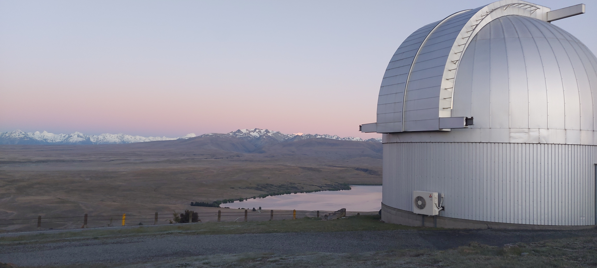

# Hello!

This website is currently under development. :)

I'm Matthew Hopkins, a third-year PhD student at the University of Oxford, working with Chris Lintott and Michele Bannister on interstellar objects with both a planetary and Galactic perspective. 

Contact me:

Email - matthew.hopkins@physics.ox.ac.uk

Here's a cool photo I took at UC Mt John Observatory:

